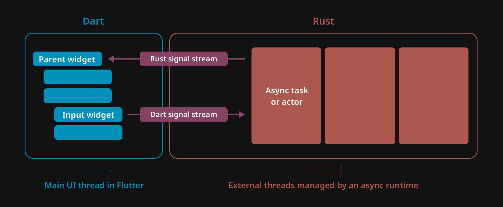

# Introduction

## About Rinf

Rinf combines Flutter's UI ease with Rust's speed, enabling efficient, scalable cross-platform apps.

```{eval-rst}
.. raw:: html
   :file: _templates/icon_pair.html
```

### Design

Rinf expects the application's main logic to be written in Rust, with Flutter solely managing the GUI.



Rinf adopts a two-way, stream-based message-passing mechanism rather than relying on function calls. This decouples the business logic from the UI, ensuring a clear separation of concerns.

Using the actor model on the Rust side and tree-based state management techniques such as `InheritedWidget` or `provider` in Flutter is recommended for effectively propagating state changes.

## Cross-Platform Compatibility

Rinf enables seamless development across major platforms:

- ✅ Linux: Tested and supported
- ✅ Android: Tested and supported
- ✅ Windows: Tested and supported
- ✅ macOS: Tested and supported
- ✅ iOS: Tested and supported
- ✅ Web: Tested and supported
